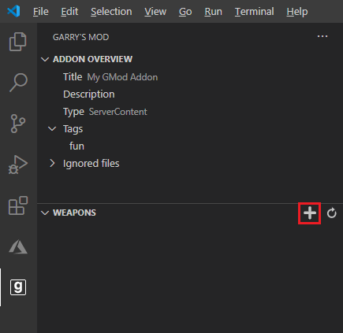
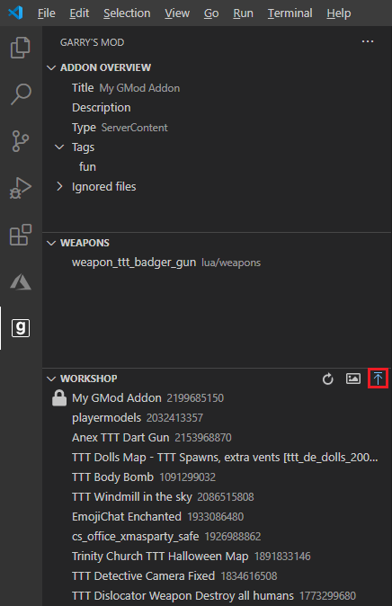
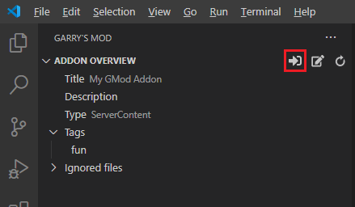
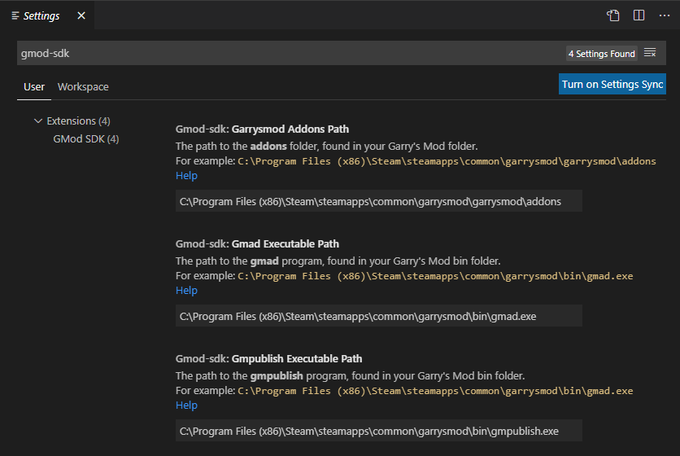

# GMod SDK for Visual Studio Code

A VS Code extension to make GMod addon development easier.

With this, you can quickly create and upload Garry's Mod addons to the workshop.

 

It is recommended that you also install the [GLua language support extension](https://marketplace.visualstudio.com/items?itemName=aStonedPenguin.glua), for improved syntax highlighting and suggestions.

 

# Create your first Workshop item
1. Open a folder in VS Code and click Create Addon

    

2. Add your content to the addon. 
    For example, create a weapon using the weapons interface.

    

3. Upload your addon to the workshop (Steam must be running).

    

 
 

# Features

## Addon Development
_Create and use an addon within minutes!_

* Create an addon from an empty folder
* Copy an addon project to your Garry's Mod folder (and use it in-game!)
* Create a Garry's Mod weapon from different templates for TTT and Sandbox

 

_Copy addons to your Garry's Mod folder and test them in-game_  

 

## Workshop Tools
_Manage your workshop files at the click of a button!_

* Upload an addon to your workshop- maps, weapons, gamemodes, etc.
* Update an existing addon on the workshop
* Change an addon's thumbnail

 
 

# Configuration
1. Press `ctrl` + `,` or go to `File` -> `Preferences` -> `Settings`
2. Search for `gmod-sdk`

 

## Set your Garry's Mod folder location

In order for this extension to work, it needs to know where your Garry's Mod folder is located.  
In the settings, you will need to set your

* Addons folder location
* gmpublish program location
* gmad program location

If you need help finding these things, there is a helpful guide [here](https://gist.github.com/BadgerCode/00600eab40556c6e8809590d263ea053).

 
 

# Contributing
* Ideas/Problems - Please create an issue on Github or find an existing thread. We want to make Garry's Mod addon development easier for you!
* Code
    * Clone this repository and open it in VS Code
    * Open a terminal and run `npm install`
    * To debug, press `F5`. This will open a new window with the extension running.
        * Use `ctrl+r` to reload the window

# Resources
* Icons
    * [Font Awesome](https://fontawesome.com/icons/list)
    * [Azure Functions Extension](https://github.com/microsoft/vscode-azurefunctions)
    * [VS Code Extension Examples](https://github.com/microsoft/vscode-extension-samples/)
    * [Garry's Mod Logo](https://icons8.com/icons/set/garrys-mod)
